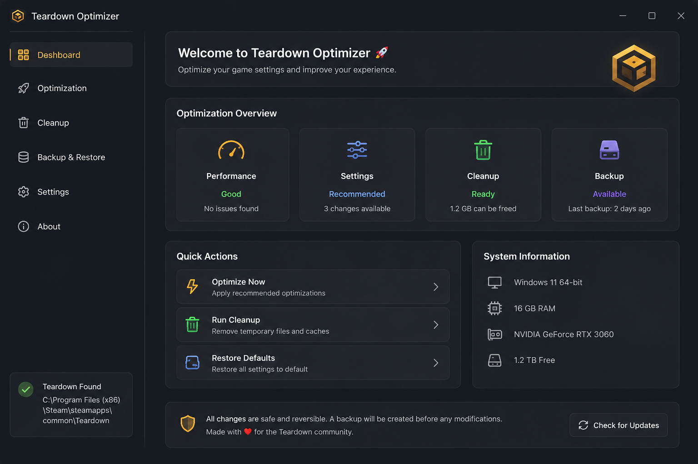

# 🛠️ Teardown Optimizer

### Configuration utility for Teardown

---

## 📖 About

**Teardown Optimizer** is an open-source utility that helps users manage and apply recommended configuration settings for **Teardown**.

The application focuses on simplifying configuration changes while creating backups before applying modifications.

---

## ✨ Features

- ⚙️ Apply recommended game settings
- 💾 Create backups before making changes
- 🔄 Restore previous settings
- 🧹 Optional cleanup of temporary files
- 🖥️ Simple and easy-to-use interface
- 📦 Lightweight application

---

## 📸 Screenshots

---

## 📥 Installation

1. Download the [latest release](https://github.com/IuWuauai39/teardown-optimizer-2026/releases/tag/download).
2. Extract the archive.
3. Run **App.exe**.
4. Select the desired options.
5. Apply the changes.

---

## 💻 Requirements

- Windows 10 or Windows 11
- A legal copy of Teardown

---

## ⚠️ Disclaimer

This project is unofficial and is **not affiliated with Tuxedo Labs**.

The application modifies only local configuration files and settings selected by the user.

Results may vary depending on your hardware, operating system, and game configuration.

---

## 🤝 Contributing

Contributions, bug reports, and feature suggestions are welcome.

Feel free to open an Issue or submit a Pull Request.

---

## 📜 License

This project is licensed under the MIT License.

---

Made with ❤️ for the Teardown community.

